# Kafka course notes

https://www.linkedin.com/learning/learn-apache-kafka-for-beginners/apache-kafka-in-five-minutes?u=70820380

## What is kafka what does it do

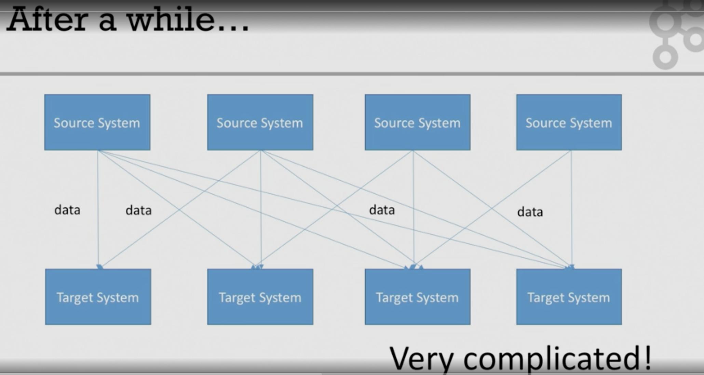

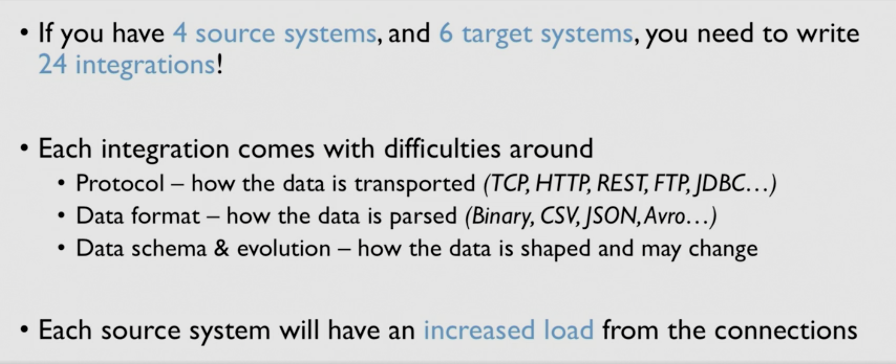
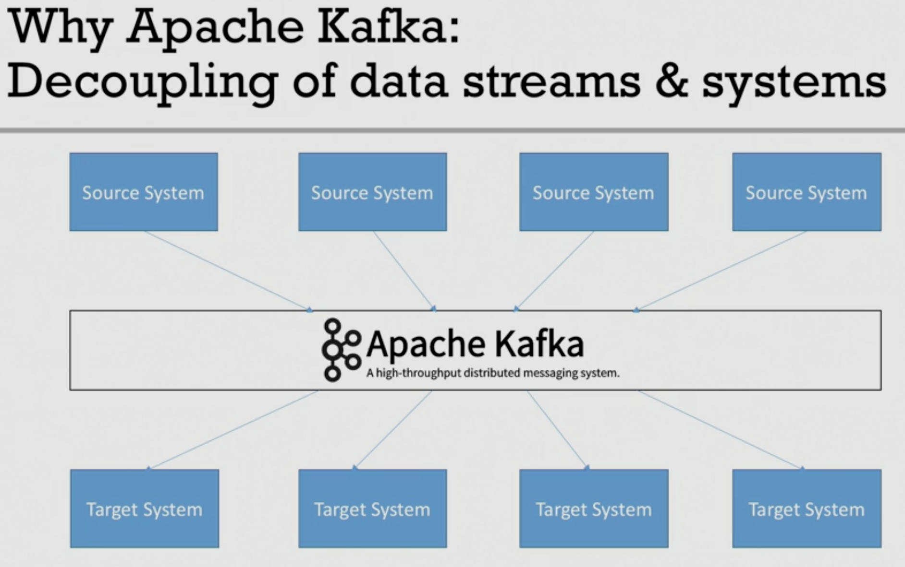
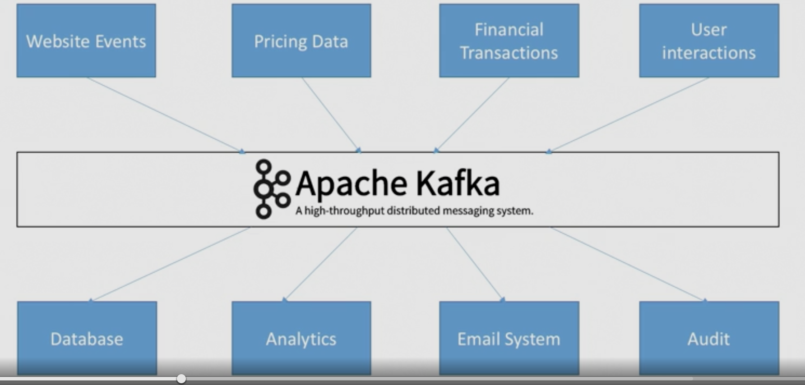
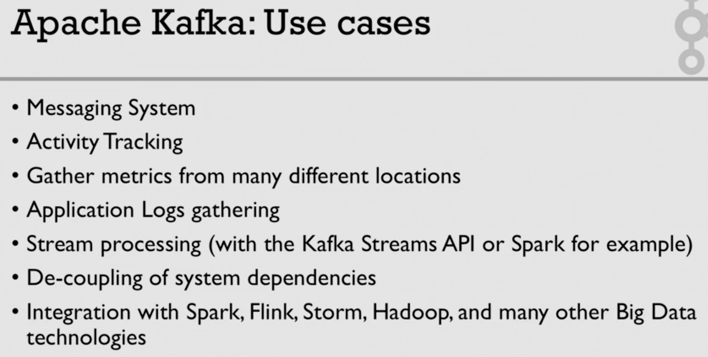

## Kafka Theory

-  __Topic__ is a particular stream of data 
   -  similar to a database table or ROS topics
- Topics are split into __Partitions__
  - each partition gets an incremental id, partitions are ordered (sequential)
  - when you create a topic you have to specifiy how many partitions it has, you can change that later on
- Each partition receives messages, messages ids are incremental too (in sequential order, first msg is 0 second is 1,2,3 ...etc)
  - Each partition receives independent messages, even though they are members of the same topic
  - msg ids are called offsets, they are always incremental even if old data got deleted, if msg 1 -> 100 got deleted the new msg will have id 101, 102 ...etc even though the older msgs with ids 1 to 100 are not there anymore
  - offsets or msg ids are tied to a partion, each partion has it's own ordered msgs.
  
Example

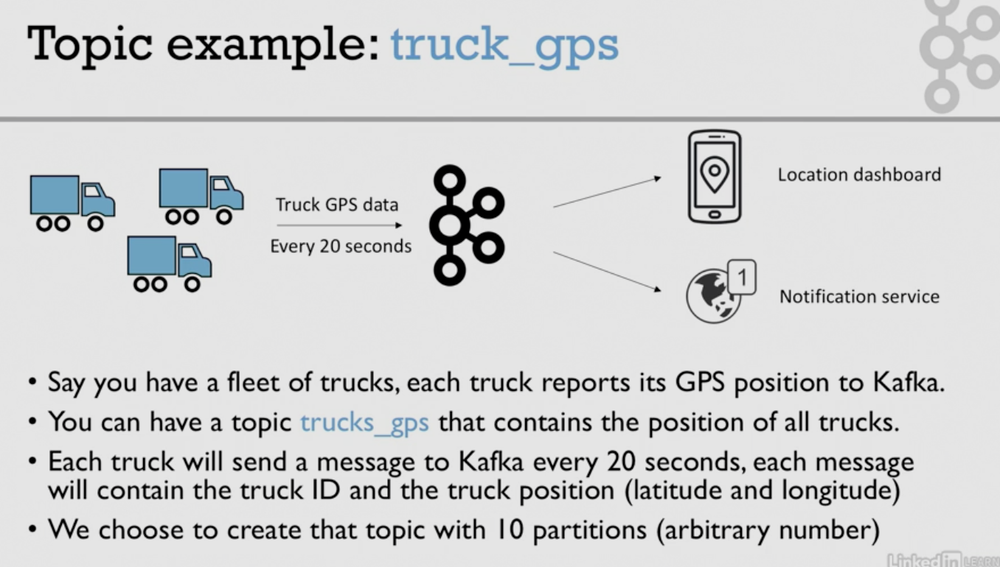

* about topic partitions and offsets 
	-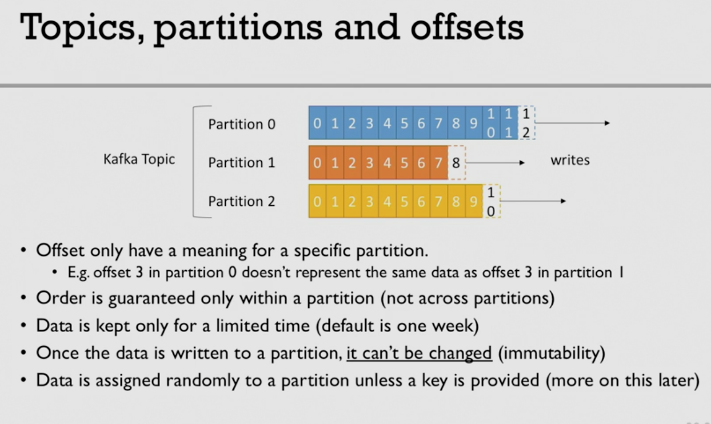
	- You can change how long data stays, you can even set it to stay forever like a database if you want (there are use cases for that but permenant storage not what kafka is meant to do)

- What is the thing that holds topics? a __Broker__ does
  - A broker holds muliple topics, a topic holds multiple partitions, a partiion holds multiple messages
  - A cluster holds multiple brokers
  - Each broker is a server basically. A cluster is multiple servers
  - Each broker has an id integer
  - Each broker contains some or certain topic partitions (not all of them since kafka is a distributed system)
  - After connecting to any broker (called a bootstrap  broker) you will get connected to the entire cluster.

When you create a topic kafka automatically distributes that topic partions across many brokers.
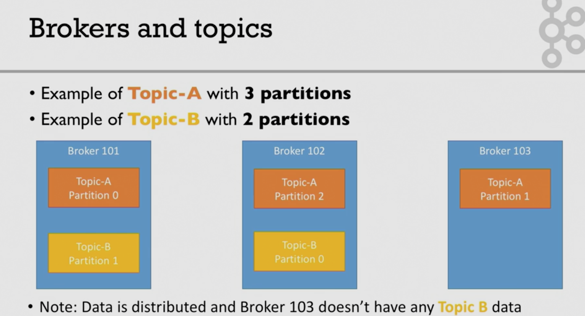

A distributed system usually has some sort of replication so that if one machine goes down the sytem still works because we have a replica of the data. Also if more than one system wants the same data we can replicate it to split the load among two brokers instead of having one broker which makes our msging system faster. In kafka this broker replication is called replication factor

Replication factor of 2 means you have 2 copies of the data, the first one is the original the second is the copy. Be careful! replication factor of 2 doesn't mean you have 2 copies and the original that's wrong!! it means that the total number of copies is 2 including the original. When replication factor is 1 then that means we only have the original data and there's no replication.
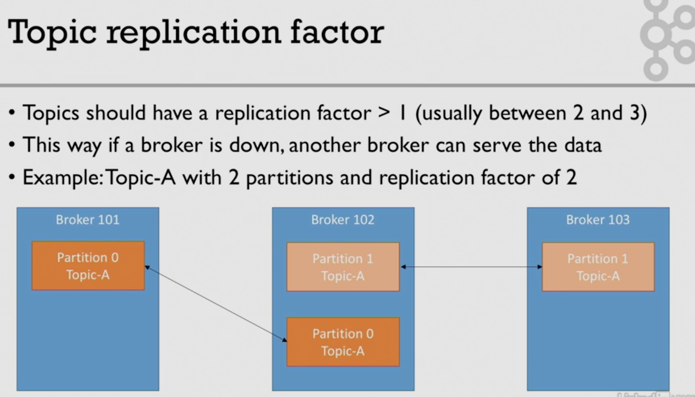
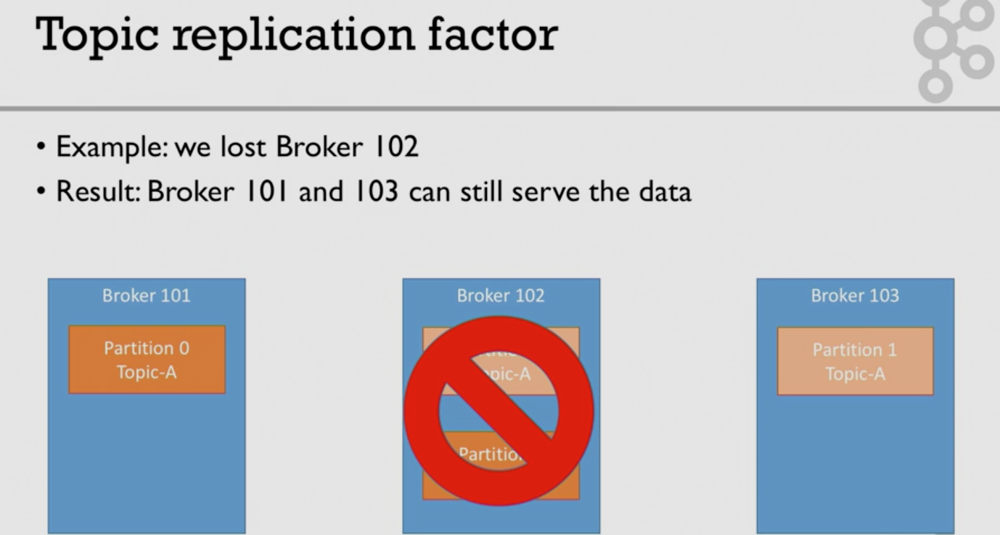

 

- __Broker as a leader for a partition__

	Only one broker can be the leader for a partition, only the leader can receive and serve data for the partition. Other brokers will just sync data with the leader. Therefore, every partition has one leader and muliple in-sync-replica (ISR).
	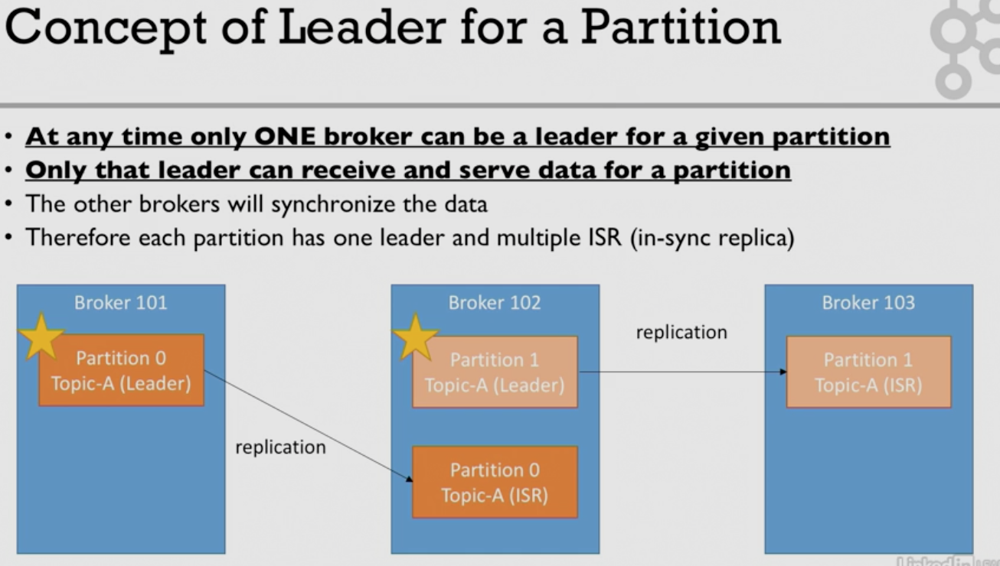
	Zookeeper is the one that chooses who is the ISR or leader

 

- __Producers__ write data to topics
  - producers automatically know which broker and partition to write to.
  - 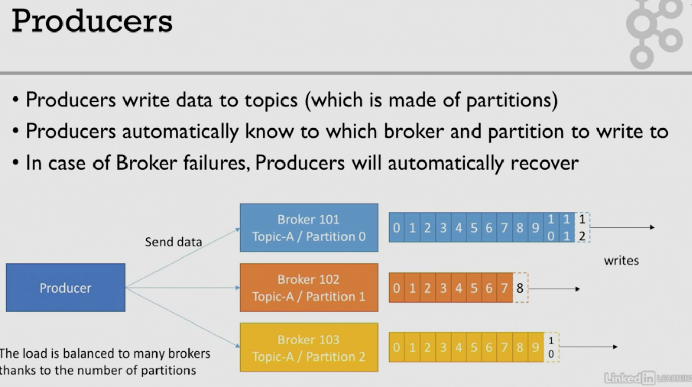
  - Producer can choose to receive acknowledgment of data write (like confirmation that write happend), there are 3 settings:
    1. acks = 0, producer will not wait for write achnowledgment (possibe data loss, maybe write didn't happen if broker is down or there's other problem)
    2. acks = 1, which is the default. Producer will wait for the leader's achnowledgment (limited data loss, but it still happens in some cases)
    3. acks=all, leader and replicas acknowledgment ( no datal loss)
   
   - Producers can choose to send a msg key with the msg, can be any data type.
   -  If there's no key sent then the message will be sent in round robin which means that message 1 will be sent to broker 100, msg 2 sent to broker 101, msg 3 to broker 102 ... and so on menaing that each message will go to the next broker in line.
   - if there is a key, all msgs with that key will go to the same partition.
   - 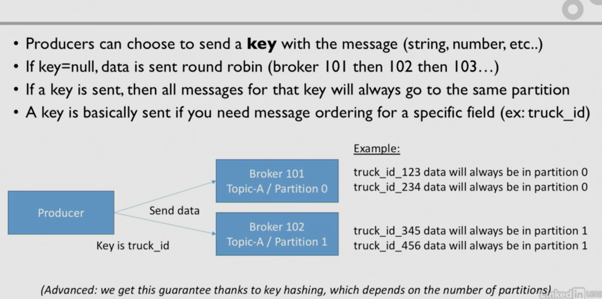

- __Consumers__ 
  - know where to read data from a topic
  - they know which broker to read from
  - data is read within each partition 
  - 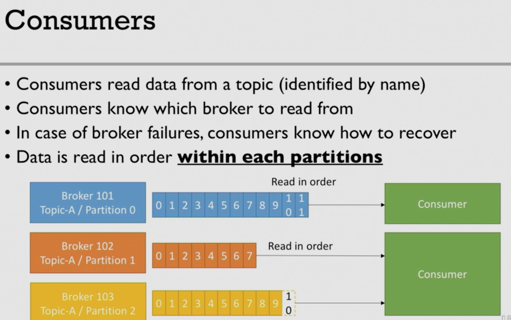
  - 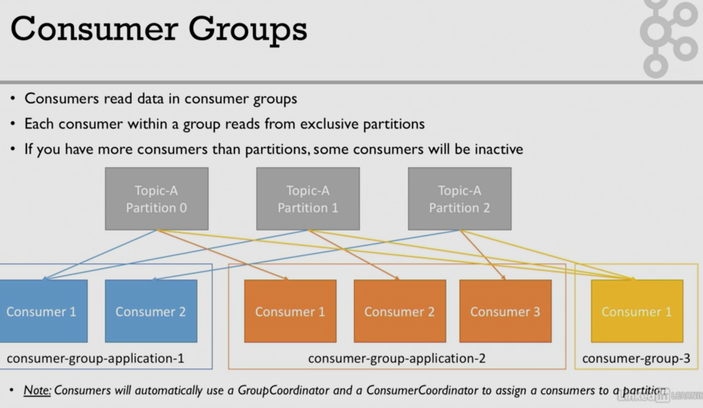
  - 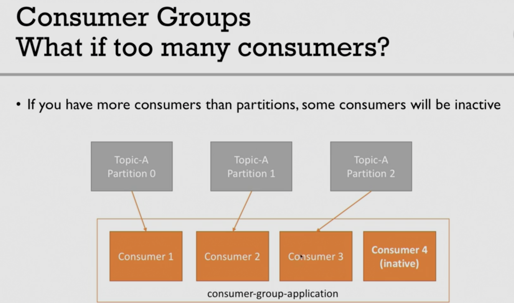
  - In short within a consumer group (one application, say a dashboard application) the max number of consumers is the number of partiions, we can have less consumers but not more that the num_partiions otherwise excess consumers will be inactive, this is within the same consumer group but you're allowed multiple consumer groups.
  - kafka stores the offsets of the messages the consumer has been reading, these offsets are published in the topic named `__consumer_offsets`
    - this is super useful becasue if the consumer died, and then cameback online it will be able to read data exactly where it left off.
  - consumers choose when to commit their offsets (publish to the __consumer_offsets topic). There are 3 ways a consumer can publish its offsets:
    1. At most once: offsets are committed as soon as the msg is received, if the consumer died and goes back online the msg will not be read again (msg lost)
    2. At least once (preferred way): offsets are comitted after the msg has processed (not right after reciving but after you're done using the msg) if something went wrong the msg will be read agian. This approch does mean that you may read the same msg twich __make sure that your system can handle that and reading the same msg again will not cause issues__
    3. Exactly once: usually for kafka to kafka systems, if you use external systems better use `At least once` mode 

- 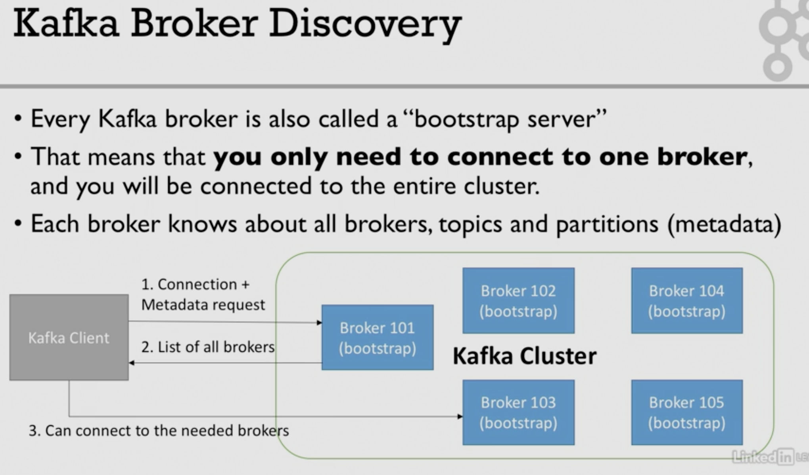

- __Zookeeper__	
  - zookeeper is how kafka manages it's own metadata, you dont read or write to it directly
  - 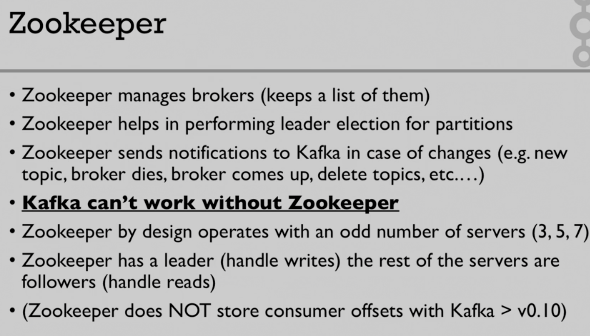
  - 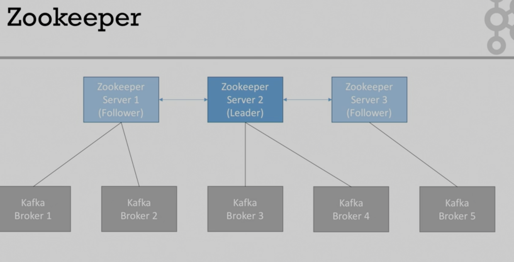

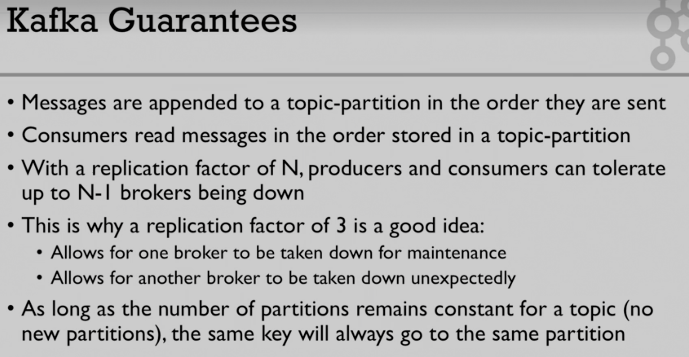
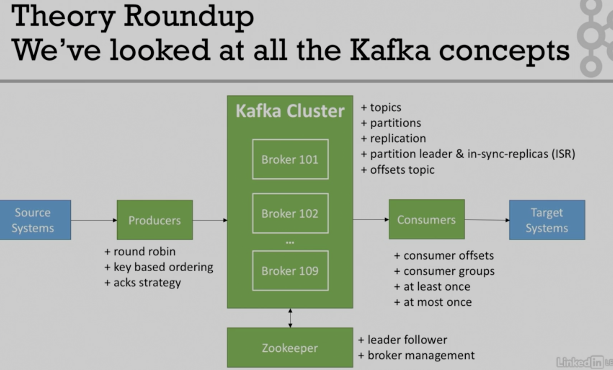

## CLI

 you need to run both zookeeper and kafaka in the bg after that you can run commands.
 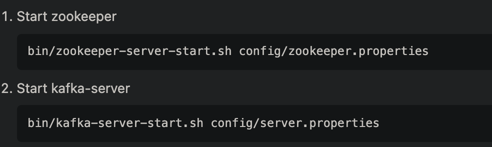
 - `kafka-topics.sh --bootstrap-server 127.0.0.1:9092 --topic first_topic --create --partitions 3 --replication-factor 1`
  
- `kafka-topics.sh --bootstrap-server 127.0.0.1:9092 --list`
- `kafka-topics.sh --bootstrap-server 127.0.0.1:9092 --topic first_topic --describe`

note that 9092 is the broker and 2181 is zookeepr, you want to connect to the broker not zookeeper

- 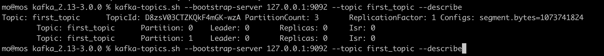
  leader 0 means that the leader broker id is 0

- if you want to create a console message producer: ` kafka-console-producer.sh --bootstrap-server 127.0.0.1:9092 --topic first_topic` you will see a place where you can type msgs to console
- if you want to set the acknoledgement property ` kafka-console-producer.sh --bootstrap-server 127.0.0.1:9092 --topic first_topic --producer-property acks=all`
- if you try to use console producer with a topic that doesn't exist kafka will give you a warning and create the topic for you with one partition and one replicaiton factor.
  - 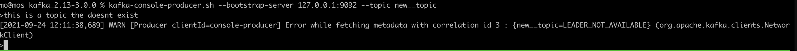
  - you can change the default by editing config/server.properties file

Kafka consumer
 - `kafka-console-consumer.sh --bootstrap-server 127.0.0.1:9092 --topic first_topic`
   - this will read realtime msgs
   - use `--from-beginning` you will see all msgs, note that the order is per partition so if you want proper order make sure you publish to the same parition
- to split messages between consumers in the same group use the flag `--group group_name` 
  - 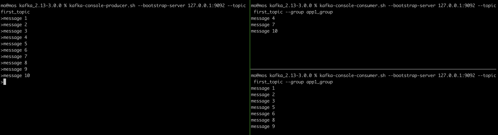
  - there are two consumers in this group and the topic has 3 partiitons we see how the messages get split between them (the load is balanced between the consumers in the group)
  - When you do `--from-beginnning` with a group, then the messages offsets is shared with the entire group, so if now you start a consumer with from the beginning flag and it reads everyting, you close it, then later you open another consumer with the flag you will notice that the beginning messages will not be read, that's becasue another consumer is the group as already read those and incremented the offset.
  - `kafka-consumer-groups.sh --bootstrap-server 127.0.0.1:9092 --list`
  - with the command above note that when you create a consumer without a group kafka will generate a random consumer group for me
  - ` kafka-consumer-groups.sh --bootstrap-server 127.0.0.1:9092 --describe --group app1_group` describes a group
  - 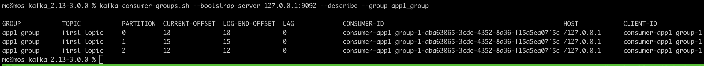
  - LAG is the difference between log end offset and the current offset. ie if lag is zero we are caught up on all the messages. The lag is the number of messages we need to catch up ie unread messages.
  - you can use the flag `--reset-offset optionName --execute --topic topicName` to see offsets that aren't showing you have many options